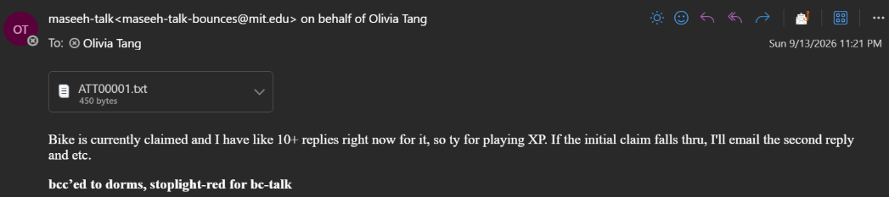
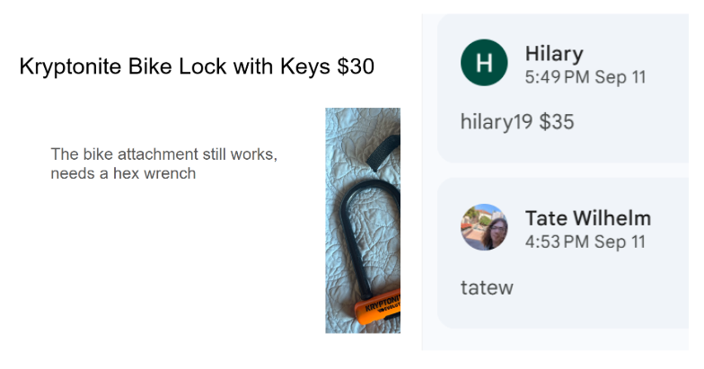
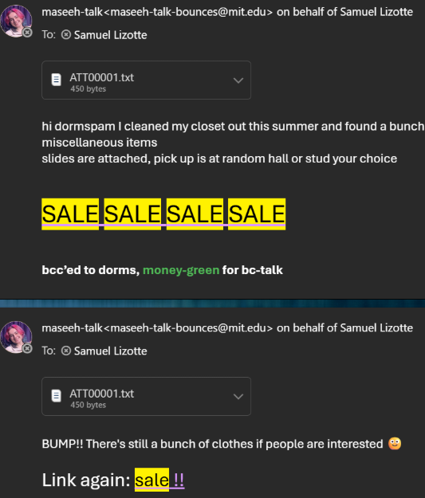
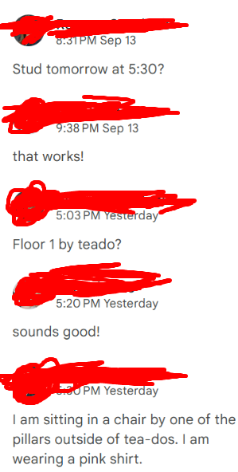
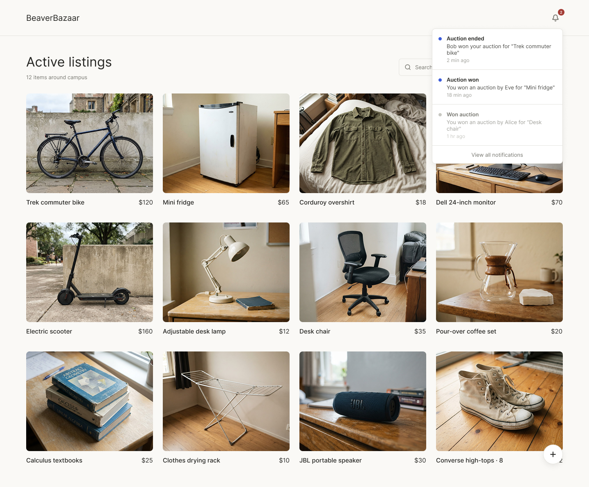
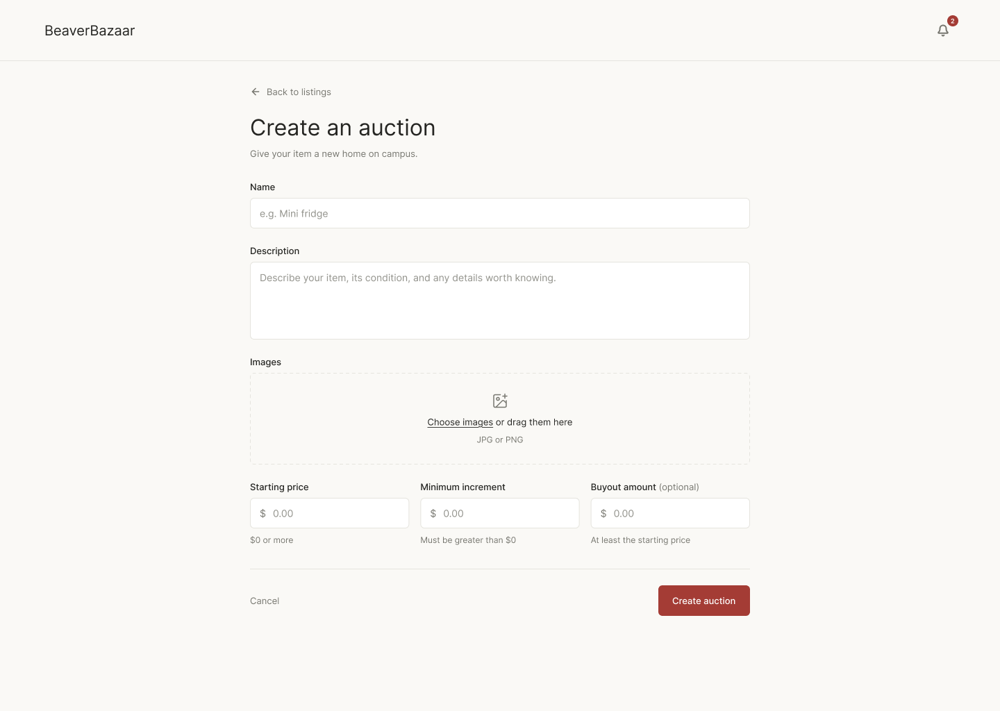
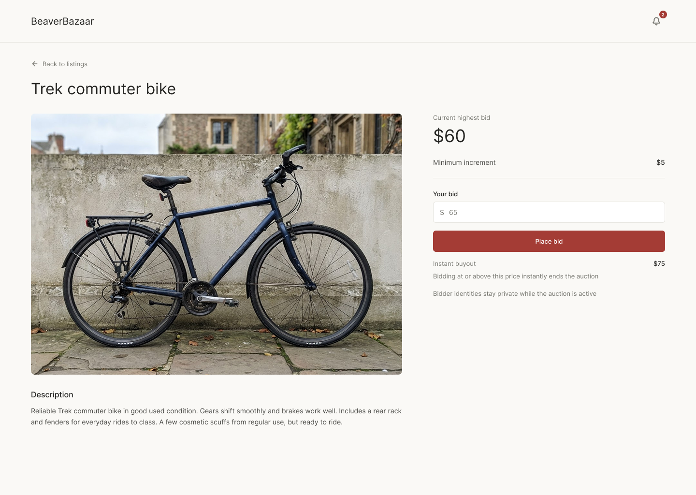

# Problem Framing

## Domain
Every year, students often realize that they have stuff that they have no use for anymore or can't keep. This is due to a myriad of reasons, such as it being too expensive to store/transport belongings in between school years. To either recoup the value of such items, reduce waste, or simply find someone who has more use, students attempt to re-sell to their peers. To this end, it has become a cultural phenomenon for students to engage in garage sale-like listings on Dormspam. These listings often come in the form of images, spreadsheets, or - most commonly - slideshows. They all follow the same format: a list of rules, contact information, what's being sold, and an asking price. Potential buyers interact with listings by leaving comments of either negotiated prices, or "claim \<kerb\>" to signal that they have agreed to purchase the item at the stipulated price. However, this hacky use of slideshows is extremely unorganized, which becomes particularly apparent with auction-like bidding. Additionally, in cases potential buyers already know what they want, they must scan dozens of slideshows to check for the presence of specific items.

*dormspam: MIT's informal mailing list where community members share events, club info, free food, sales, housing, surveys, etc.*

*Kerberos (kerb): Authentication system employed at MIT. "kerb" is used affectionately to refer to one's username*

## Stakeholders

### Sellers
- Manage inventory and update listings as items are claimed
- Answer questions
- Coordinate pickup and payments

### Buyers
- Regularly monitor dormspam for new listings
- Claim items/negotiate the best price
- Coordinate pickup

## Bad Situations

### Uncoordinated Bidding Wars
> Bob is selling a bicycle on dormspam. He pushes an email to dormspam to see if anyone is interested, and gets dozens of private emails back. Bob has to update each potential buyer with the latest/highest offer as they come in. Worst yet, if the highest bidder flakes, the seller must decided to either: (a) fall back to the next highest bidder or (b) restart the bidding process.

In the image below, we can see an exmaple of this bad situation. The seller has received a bunch of private replies to their original listing, each of whom are offering to pay the stipulated price. The issue here is that whether the status of the listing being up-to-date or not depends on the seller manually checking and updating it. Other users have no idea whether or not someone has already offerred to pay the stipulated amount.

### Premature Claims
> Alice is selling a mini-fridge on dormspam for $50. Bob comments "claim bob", thinking he got a good deal and has secured the item. Eve knows that buying a new mini-fridge would cost much more retail, so she offers $100, despite Bob having already claimed the item. Alice checks the listing the next day and has two choices: (a) honor the sticker price, or (b) permit Eve's offer.

This bad situation is extremely similar to the one above, but it is subtley different. Specifically, we have fixed the problem of syncing; i.e. people know what offers others have made. However, we are still limited by how often the seller manually updates the listing. Here, if the seller was checking frequently, the bike lock would have gone to Tate. However, during that time, Hilary has offered more money, so it's unclear whether Hilary was even allowed to make that offer, and who the bike lock should go to.

### Desired Item
> Bob lives at Next House and realized that a scooter would be really nice to have. However, buying a scooter from retail is extremely expensive, so he starts browsing dormspam for any listings. Bob ends up going through a dozen of the latest dormspam listings, but only finds clothes and stickers, no scooter. Bob doesn't want to be late to a listing and miss the opportunity to bid, so he repeats this every day for a week or two before finally finding a listing selling a scooter.

### Information Decay
> Alice is selling a monitor on dormspam but hasn't gotten any satisfactory offers. She suspects this is due to a lack of traffic and bumps her email on dormspam. However, by the end of the day, due to the sheer number of people posting to dormspam, Alice's listing has been pushed back to the bottom. Alice and other sellers continuously bump their listings for the next few weeks until they get sold, or are forced to agree to unsatisfactory offers due to time constraints.

Below, we can see the pattern of bumping dormspam listings as slowly drift to the bototm as there is no activity on the email thread itself.  \

### Social Stigma
> Bob is selling mental health books. Many people are interested in purchasing Bob's books, but don't want the public to know. They email Bob privately, who then has to coordinate these emails. *(see **Uncoordinated Bidding Wars**)*

### Privacy
Clearly the bad situation here is that since neither the buyer nor seller opted to publicly disclosing their contact information, e.g. phone numbers, they have to be okay with publicly coordinating the hand-off. There simply isn't any real option here, as in either way, their privacy is "voluntarily" violated. \

## Workaround & Comparables
### Dormspam
- It's become ingrained in MIT's culture that useful information things can be found in dormspam
- As a result, nearly every student is subscribed to dormspam
- All participants are already verified to be MIT community members
- To maximize returns and turnover rate, sellers want to reach as many peers as possible, as fast as possible
- Neither slideshows or emails are suited for inventory management, coordinating auctions, and communication

### eBay & Depop
- Solve bidding mechanics
- Offers in-person pickup
- High fees, even for in-person pickup (>13%, >3%, respectively)
- High volume; extremely competitive and requires large amount of maintenance
- Difficult to limit participation to MIT community members
- Requires an account to participate

### Craisglist & Facebook Marketplace/Groups
- Difficult to limit participation to MIT community members
- Could result in non-MIT community members showing up
- Requires an account to participate

## Soltuion Sketch
A companion webapp for the MIT community to post and participate in listings
- Authenticate users via Kerb & Touchstone
  - MIT community members already have a Kerb
  - Their Touchstone login is cached; no account creation or sign-in needed
  - All users are guaranteed to be MIT community members
- Integrated auction system (addresses "Uncoordinated Bidding Wars" and "Premature Claim" bad situations)
  - Sellers can set a starting price
  - Sellers can set a satisfactory instant-claim buyout price
  - Buyers can set a maximum-price they are willing to bid; service automatically bids in increments for them
  - Deadlines
- Pseudoanonymous listings and bidding
  - Allows for more "sensitive" listings
  - Maximizes participation
  - Privately shares preferred contact method between buyer & seller when listing resolves
  - Resolves "Privacy" bad situation, as users no longer need to choose between publicly disclosing contact information or publicly coordinating handoffs
- Notifications
  - New listings that match keywords in potential buyers' wishlist (addresses "Desired item" bad situation)
  - Updates (bids, description, etc.) on bookmarked listings
- Searching/sorting of listings by name, price, deadline, etc. (addresses "Desired item" bad situation)

# Application Pitch

BeaverBazaar aims to make the process of buying and selling on dormspam more convenient, while retaining dormspam's cultural charm. Currently, emails and slideshows are hacked together to act as an auction platform, resulting in compromises on fairness, privacy, and efficiency. To this end, BeaverBazaar offers a free-to-use companion platform that sellers can link to with their dormspam emails. Users will not need to create a new account; MIT community members authenticated through Touchstone will immediately be able to create, view, and bid on listings within the platform. Listings support automated bid increments, deadlines, and instant-claim prices, replacing messy comment threads and confusing rules. To protect student privacy, BeaverBazaar masks participant identities during active bidding so users can transact without broadcasting their personal interests or finances. Once a listing resolves, BeaverBazaar will automatically and privately share contact information between buyer/seller, keeping personal information off public feeds. Users retain complete control over their transactions by handling payments and pickups peer-to-peer.

# Concept Design

## Concepts

**concept** \
Listing[User, Item]

**purpose** \
users can display an item for public viewing by publishing it

**principle** \
an owner publishes a listing for an item;
the owner modifies aspects of the listing while active; \
the owner deactivates the listing while active; \
finally the owner deletes the listing

**state** \
a set of Listings with
- an owner User
- an item Item
- an active Flag

**actions** \
`create (owner: User, item: Item) : return (listing: Listing)` \
    *then* creates and returns the listing with `active=True`

`update (owner: User, listing: Listing, item: Item)` \
    *where* `owner` is the owner of `listing`, `listing` is active \
    *then* replaces the item in `listing` with `item`

`deactivate (owner: User, listing: Listing)` \
    *where* `owner` is the owner of `listing` and `listing` is active \
    *then* deactivates the listing

`delete (owner: User, listing: Listing)` \
    *where* `owner` is the owner of `listing` \
    *then* removes the listing from the set and deletes it

---

**concept** \
Auction[Owner, Item, Bidder]

**purpose** \
allow bidders to bid incrementally on an item owned by owner, or through an instant-claim buyout \
*(does not handle allocating the resource)*

**principle** \
an owner starts an auction for item with a starting price, increment, and optional buyout price; \
bidders place sequentially higher bids while active, incrementing by a minimum amount; \
bidding at or above the buyout price instantly ends the auction; \
otherwise, the owner can end the auction while active; \
finally, the owner can delete the auction \

**state** \
a set of Auctions with:
- an owner Owner
- an item Item
- [a highestBidder Bidder]
- a price Number
- an increment Number
- an active Flag
- [a buyout Number]

**actions** \
`create (owner: Owner, item: Item, startPrice: Number, increment: Number [, buyout: Number]) : return (auction: Auction)` \
    *where* `startPrice >= 0`, `increment > 0`, and (`buyout == None` or `buyout >= startPrice`)
    *then* creates and returns `auction` with the arguments as its fields (e.g. `price=startPrice`), as well as `active=True` and `highestBidder=None`

`bid (bidder: Bidder, auction: Auction, amount: Number)` \
    *where* `bidder != owner`, `active=True`, and `amount >= price + highestBidder ? increment : 0` \
    *then* updates `price=amount` and `highestBidder=bidder`

`close (owner: Owner, auction: Auction)` \
    *where* `owner` owns `auction` and `active=True` \
    *then* updates `active=False`

`delete (owner: Owner, auction: Auction)` \
    *where* `owner` owns `auction`, `active=True`, and `highestBidder=None` \
    *then* removes the auction from the set and deletes it

---

**concept** \
Pseudonym[Context, User]

**purpose** \
provide a trackable, bijective, and anonymous alias within a context to conceal the identity of a user

**principle** \
a pseudonym for a user is generated within a context; \
the pseudonym for a user can be retrieved within the context; \
the user behind a pseudonym can be retrieved within the context

**state** \
a set of Pseudonyms with:
- a context Context
- a user User
- an alias String

**actions**  \
`getUser (context: Context, alias: String) : return (user: User)` \
    *where* there is a pseudonym within `context` using `alias` \
    *then* returns the corresponding `user` for that pseudonym

`getAlias (context: Context, user: User) : return (alias: String)` \
    *then* if user has a pseudonym within `context`, returns the corresponding `alias` for that pseudonym \
    otherwise, creates and adds to the set a pseudonym for `user` using an alias that is unique within `context`, returning that alias

---

**concept** \
Notify[User, Message]

**purpose** \
add a message to a users log of notifications

**principle** \
there is a message to be conveyed to a specific user by the system; \
the message is sent as a notification

**state** \
a set of Notifications with:
- a user User
- a message Message

**actions** \
`notify (user: User, message: Message)` \
    *then* creates and adds to the set a notification for `user` with `message`

## Reactions
**reaction** createAuctionListing \
**when** Requesting.createAuction (user, item) \
**then** Listing.create (owner: user, item)

**reaction** initAuction \
**when**
    Requesting.createAuction (user, item, startPrice, increment [, buyout]) \
    Listing.create (owner: user, item) : (listing) \
    Pseudonym.getAlias (context: listing, user) : (alias) \
**then** Auction.create (alias, item: listing, startPrice, increment, buyout)

**reaction** syncAuctionListingStatus \
**when** \
    Auction.close (seller, auction) \
    Pseudonym.getUser (context: auction.item, alias: seller) : (user)
**then** Listing.deactivate (owner: user, listing: auction.item)

**reaction** syncAuctionListingDelete \
**when** \
    Auction.delete (seller, auction) \
    Pseudonym.getUser (context: auction.item, alias: seller) : (user)
**then** Listing.delete (owner: user, listing: auction.item)

**reaction** submitBid \
**when** \
    Requesting.bid (user, auction, amount) \
    Pseudonym.getAlias (context: auction.item, user) : (alias) \
**then** Auction.bid (bidder: alias, auction, amount)

**reaction** closeOnBuyout \
**when** Auction.bid (bidder, auction, amount) \
**where** `auction.buyout != None` and `amount >= auction.buyout` \
**then** Auction.close (owner: auction.owner, auction)

**reaction** notifyOnClose \
**when** \
    Auction.close (owner, auction) \
    Pseudonym.getUser (context: auction.item, alias: owner) : (user: userOwner) \
    Pseudonym.getUser (context: auction.item, alias: auction.highestBidder) : (user: userBuyer) \
**where** `action.highestBidder != None` \
**then** \
    Notify.notify (user: userOwner, message: "One of your auctions ended. Buyer: " + userBuyer) \
    Notify.notify (user: userBuyer, message: "You won an auction. Seller: " + userOwner)

### Concept Composition
Listings overall represent the visual listing of an item; e.g. the title, description, images, etc. As an invariant, Auctions are bijective onto Listings, and their status and whether or not they have been deleted are synchronized. This gives various beneficial side effects, but most notably allows us to keep the concepts of Auctioning and Listing independent. Additionally, listings are used as the context within which pseudonyms and generated and kept unique. This allows the buyers and sellers of auctions to be anonymous. Auction closing is also handled via reactions, as the `submitBid` reaction cascades/propogates all the way down to `notifyOnClose` as necessary.

# UI Sketches
*(quickly generated with Figma in a few minutes)*

# User Journey

## The Problem
Bob is a freshman living at Next House. Although at first Bob finds the walk to class enjoyable, he quickly grows tired of trekking 10 minutes first thing in the morning. Bob begins researching for Cambridge bike options, but he doesn't have that much dispoasable money. He turns towards second-hand options and begins going through dormspam at the recommendation of a friend. However, Bob quickly realizes that he can't just search through his emails and find bikes; although some sellers put "bike" in their subject line or body, it's unclear whether these bikes are still for sale, or what the current bid is. Specficially, people interested in the listing don't repy-all to the email, so Bob has no idea about the status of the listing. Bob realizes that the majority of people use slideshows to list what they are selling, but he has no clue whats in these slideshows without going through dozens of slides.

## Discovery and Authentication
Thankfully however, Bob sees a slideshow listing with a BeaverBazaar link and opens it. Bob expects to maybe have to create a new account, but is instead met with a Touchstone login redirect that automatically signs him in without doing anything. Though Bob has already been authenticated, since he is a new user, he is prompted to enter his preferred contact method, for which he simply enters his phone number. Immediately, Bob sees a sortable and searchable catalog of listings and begins playing around with the website. He tries searching up "bicycle" and is delighted to see a few options for sale. Each listing shows clear photos, description, and has an intuitive interface to place a bid.

For one specific listing, Bob sees that the current bid is $60, he must increment by at least $5, and if he bids $75 or more, the auction would immediately end. Additionally, Bob sees that if he were to bid, his identity would be replaced by a randomly generated pseudonym within that listing. Bob, however, has already had his patience drawn thin so he decides to bid $75 and claim the bicycle. Immediately, the listing closes and disappears from the public set of listings, preventing other people from getting confused about whether the listing is open/closed. At the same time, Bob gets a notification that he won an auction for a bike, which includes the seller's designated contact informration.

Without having to publicly disclose his name or any other contact information, the platform has privately notified both buyer and seller of their counterparts contact details. Bob sends the seller a text, from which they coordinate a preferred payment method and handoff privately off the platform; no one sees this besides the party involved.
